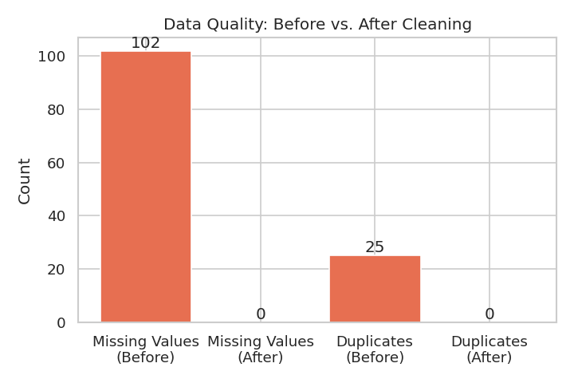
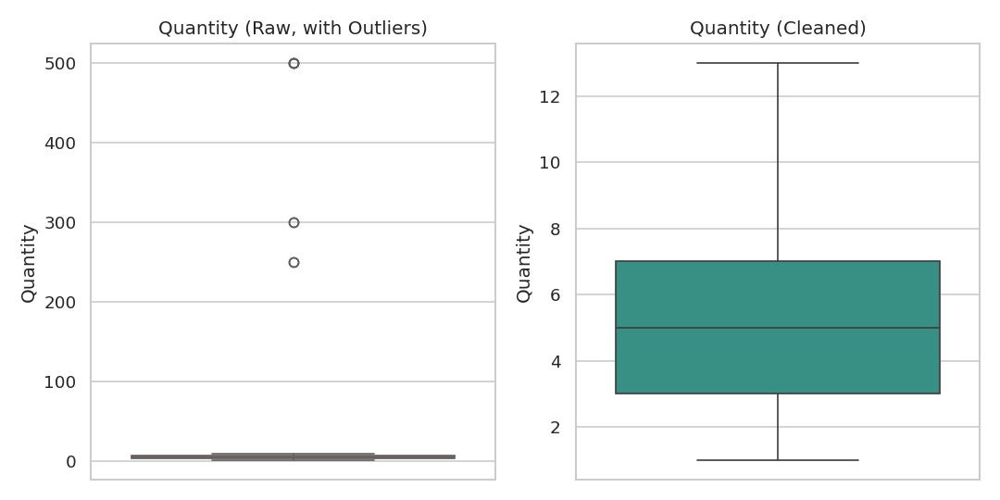
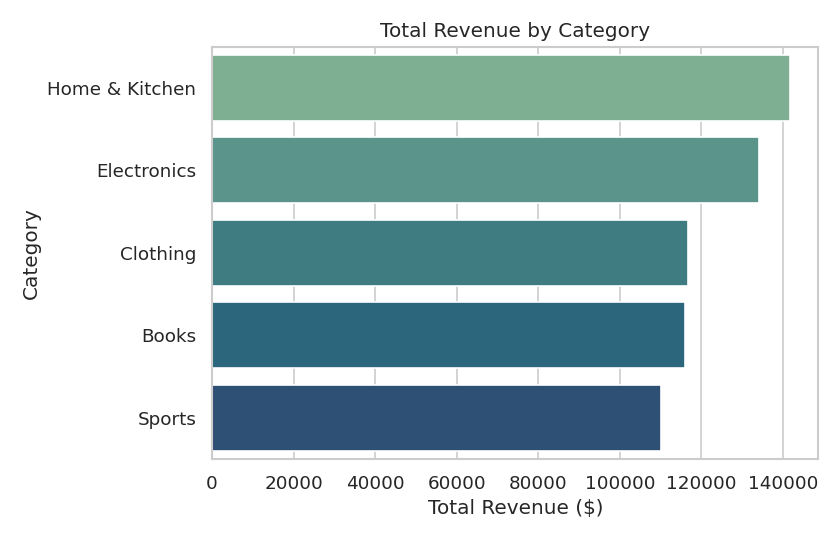
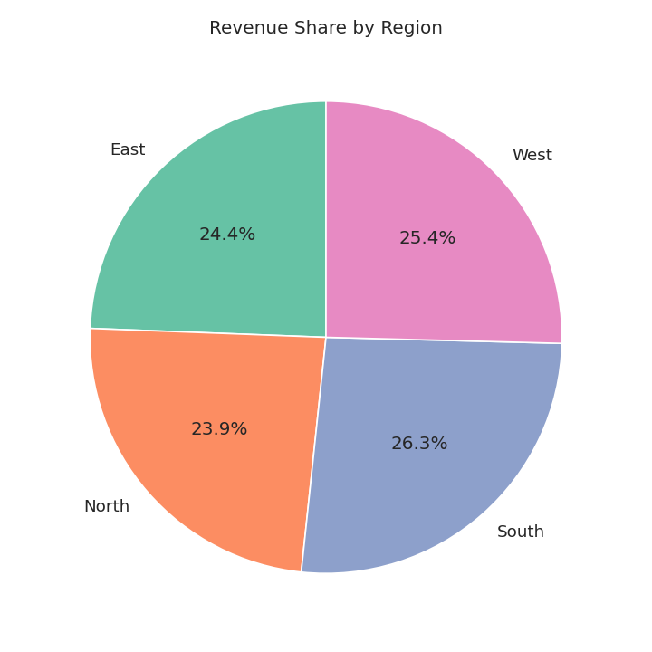
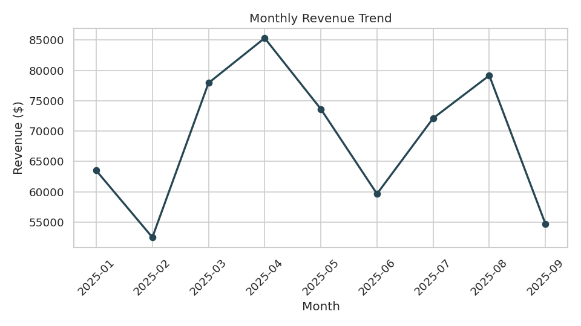
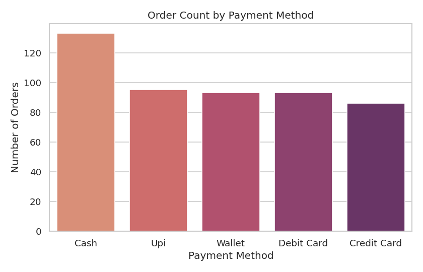

# 🧹 Data Cleaning & Visualization Project

Work on a raw dataset to clean, process, and visualize insights — handling missing values,
outliers, and duplicates using **Pandas**, **Matplotlib**, and **Seaborn**, then producing a
visual report of key findings.

---

## 📁 Project Structure

```
data-cleaning-viz-project/
├── data/
│   ├── generate_raw_data.py       # Creates the synthetic messy dataset
│   └── raw_sales_data.csv         # Raw input data (with issues)
├── notebooks/
│   └── clean_and_visualize.py     # Main cleaning + visualization pipeline
├── output/
│   ├── cleaned_sales_data.csv     # Final cleaned dataset
│   └── summary_report.json        # Machine-readable summary of the run
├── visuals/                       # Generated charts (PNG)
└── README.md
```

---

## ⚙️ How to Run

```bash
pip install pandas numpy matplotlib seaborn

python data/generate_raw_data.py          # (optional) regenerate raw data
python notebooks/clean_and_visualize.py   # clean data + generate charts
```

Outputs land in `output/` (cleaned CSV + JSON report) and `visuals/` (PNG charts).

---

## 🔍 Step 1 — Raw Data Issues Identified

| Issue | Description | Rows Affected |
|---|---|---|
| Missing values | NaNs in `Quantity`, `UnitPrice`, `Region`, `PaymentMethod`, `CustomerID` | 102 cells |
| Duplicate rows | Exact duplicate order records | 25 rows |
| Outliers | Extreme `Quantity` (up to 500) and `UnitPrice` (up to $20,000) | 14 rows |
| Inconsistent text | Mixed case / stray whitespace in `Region`, `Category` | Most rows |
| Mixed date formats | `OrderDate` stored in 4 different formats | All rows |

---

## 🧼 Step 2 — Cleaning Steps Applied

| Step | Technique |
|---|---|
| Missing numeric values | Filled with column **median** |
| Missing categorical values | Filled with column **mode** |
| Missing dates | Rows dropped (date can't be reliably imputed) |
| Duplicates | Removed via `drop_duplicates()` |
| Outliers | Capped using the **IQR method** (1.5×IQR winsorization) |
| Text formatting | Trimmed whitespace, standardized to Title Case |
| Date formats | Parsed all 4 formats into a single `datetime` type |
| Feature engineering | Added `TotalAmount` (Quantity × UnitPrice) and `Month` |

---

## 📊 Before vs. After Cleaning

| Metric | Before | After |
|---|---:|---:|
| Rows | 525 | 500 |
| Columns | 8 | 10 |
| Missing values | 102 | 0 |
| Duplicate rows | 25 | 0 |
| Max Quantity | 500 | 13 (capped) |
| Max Unit Price | $20,000 | $736 (capped) |





---

## 💡 Key Insights from Cleaned Data

**Overall revenue:** $618,566.46 &nbsp;|&nbsp; **Avg. order value:** $1,237.13

### Revenue by Category

| Category | Revenue ($) |
|---|---:|
| Home & Kitchen | 141,615.18 |
| Electronics | 134,162.41 |
| Clothing | 116,634.62 |
| Books | 115,990.62 |
| Sports | 110,163.63 |



### Revenue by Region

| Region | Revenue ($) |
|---|---:|
| South | 162,435.63 |
| West | 157,185.52 |
| East | 150,911.50 |
| North | 148,033.81 |



### Monthly Revenue Trend



### Orders by Payment Method

| Payment Method | Orders |
|---|---:|
| Cash | 133 |
| UPI | 95 |
| Wallet | 93 |
| Debit Card | 93 |
| Credit Card | 86 |



### Top 5 Customers by Spend

| Customer ID | Total Spend ($) |
|---|---:|
| CUST15 | 37,425.61 |
| CUST39 | 15,068.79 |
| CUST134 | 13,946.02 |
| CUST82 | 11,850.17 |
| CUST12 | 11,771.74 |

---

## 🎯 Expected Outcome

This project demonstrates the full workflow of:
- **Data preprocessing** — handling missing values, duplicates, and outliers
- **Visualization** — building clear, labeled charts with Matplotlib/Seaborn
- **Storytelling with data** — turning cleaned data into an actionable summary report

## 🛠️ Tools Used

`Python` · `Pandas` · `NumPy` · `Matplotlib` · `Seaborn`
